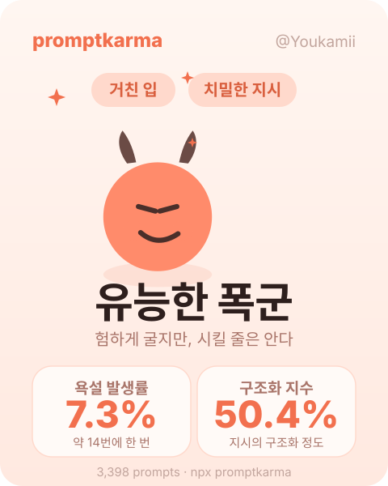

<div align="center">

# promptkarma

**AI 코딩 CLI 세션에서 당신이 친 프롬프트를 읽어, AI를 대하는 태도와 활용 능력을 매깁니다.**



</div>

## 이게 뭔가

`tokscale` 같은 서비스는 토큰을 **얼마나 많이** 썼는지 잽니다.
promptkarma는 당신이 AI에게 **어떻게** 말하는지를 잽니다.

- **인성 축** — AI에게 얼마나 험하게 구는가 (욕설 발생률)
- **능력 축** — 지시가 얼마나 구조적인가 (파일·조건·순서를 명시하는가)

두 축이 만나 네 가지 유형이 됩니다: **유능한 폭군 · 성마른 진상 · 온화한 장인 · 착한 방목자**.

## 원리

Claude Code 세션 로그(`~/.claude/projects/`)에서 **사람이 친 프롬프트만** 추출합니다.
AI 답변·도구 출력·붙여넣은 문서는 제외합니다 — 로그의 99%가 그것이고, 사람이 친 말은 1%도 안 됩니다.

- **욕설 발생률** `F = 욕설이 든 프롬프트 / 전체 프롬프트`
- **구조화 지수** `D = (구조 마커가 든 프롬프트 + 슬래시커맨드) / 전체`

전부 로컬에서 정규식으로 계산합니다. **원문은 어디에도 저장·전송되지 않습니다. 숫자만 남습니다.**

## 사용법

```bash
# 로컬 로그를 스캔하고 지표 출력
npx promptkarma scan

# 지표를 SVG 카드로 렌더
npx promptkarma card <github-username>
```

## 내 프로필에 배지 넣기

배포 후, GitHub README나 프로필에 아래 한 줄을 붙이면 카드가 뜹니다:

```markdown

```

## 측정 정의 (v1)

| 항목 | 규칙 |
|---|---|
| 프롬프트 | `entrypoint=cli`인 사람 입력만. 도구 결과·붙여넣기(5000자+)·하네스 주입 턴 제외 |
| 중복 제거 | 레코드 `uuid` 기준 (세션 resume 시 복사분 제거) |
| 표본 하한 | 프롬프트 30개 미만은 "측정 중" (작은 표본은 신뢰 불가) |

필터 정의를 바꾸면 전 유저 순위가 함께 움직이므로, 파서 변경 시 버전을 올립니다.

## License

MIT
