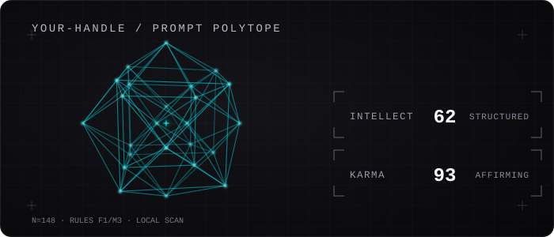

<div align="center">

# promptkarma

**Claude Code 프롬프트에서 AI를 대하는 태도와 지시 구조를 읽어, 움직이는 프로필 배지로 만듭니다.**



[**온라인 배지 스튜디오에서 내 배지 만들기 →**](https://promptkarma.vercel.app)

</div>

## 이게 뭔가요?

토큰 사용량이 “얼마나 많이 썼는가”를 보여준다면, promptkarma는 AI에게 **어떻게 말하고 지시했는가**를 두 축으로 바꿉니다.

- **KARMA** — AI를 대하는 태도. 욕설이 적을수록 차가운 청록, 많을수록 따뜻한 적색에 가까워집니다.
- **INTELLECT** — 지시의 구조와 도구 활용 정도. 점수가 올라갈수록 배지의 다포체가 복잡해집니다.

두 숫자를 읽는 표가 아니라, 모양과 색만 봐도 내 프롬프트 성향이 드러나는 프로필 장식입니다. GitHub README에 같은 주소를 붙여두면 다시 제출할 때마다 갱신됩니다.

> 정규식으로 만든 배지용 지표입니다. 능력 검사나 자격증은 아닙니다.

## 바로 써보기

Node.js 22가 설치된 컴퓨터에서 실행합니다. 첫 실행에서는 npm이 패키지를 내려받습니다.

```bash
# Claude Code 로컬 세션 스캔
npx --yes promptkarma scan

# 내 컴퓨터에 SVG 배지 생성
npx --yes promptkarma card <label>

# 원할 때만 공개 배지 갱신
npx --yes promptkarma submit <github-username>
```

현재는 Claude Code의 `~/.claude/projects/` 세션을 읽습니다. `card`가 만든 파일은 `~/.promptkarma/card.svg`에 저장됩니다.

## 프로필에 붙이기

한 번 제출한 뒤 아래 코드를 GitHub 프로필 README에 붙입니다.

```markdown
[](https://promptkarma.vercel.app)
```

[배지 스튜디오](https://promptkarma.vercel.app)에서는 로그인 없이 사용자명, 배지 스타일, 테마를 바꾸고 README 코드를 복사할 수 있습니다. 공개값이 없으면 점수 대신 표본 상태만 보입니다.

## 두 축은 어떻게 계산하나요?

Claude Code 로그에서 사람이 직접 입력한 프롬프트만 골라 계산합니다.

### KARMA

```text
KARMA = 100 - 욕설 포함 프롬프트 비율 × 5
```

0에서 100 사이로 자릅니다. 욕설이 많을수록 `CAUSTIC`, 적을수록 `AFFIRMING` 쪽 색이 됩니다. 칭찬 표현이 욕설보다 많이 잡히면 가운데 코어가 빛납니다.

### INTELLECT

```text
INTELLECT = 100 × (구조가 있는 프롬프트 + 슬래시커맨드) / (사람 프롬프트 + 슬래시커맨드)
```

파일 경로, 코드 블록, 링크, 조건, 요구사항, 두 항목 이상의 목록 중 하나가 있으면 구조가 있는 프롬프트로 셉니다. 슬래시커맨드는 도구를 직접 고른 신호로 포함합니다.

도구 출력, 자동 입력, 5,000자를 넘는 붙여넣기, 중복 UUID는 제외합니다. 표본이 30개보다 적으면 두 축을 숨깁니다.

## 도형 = INTELLECT

배지는 정사면체 하나와 4차원 볼록 정다포체 6종을 합쳐 일곱 단계로 나뉩니다.

| INTELLECT | 도형 | 라벨 |
|---|---|---|
| 0–17 | 정사면체 | CHAOTIC |
| 18–33 | 5-cell | SCATTERED |
| 34–45 | 16-cell | LOOSE |
| 46–55 | 8-cell | DELIBERATE |
| 56–67 | 24-cell | STRUCTURED |
| 68–83 | 600-cell | SYSTEMATIC |
| 84–100 | 120-cell | EXACTING |

다포체는 4차원 회전 좌표를 SVG 프레임으로 구워 움직입니다. 정적 SVG만 지원하는 화면에서도 첫 프레임의 도형이 보입니다.

## 배지 스타일

### Polytope

모양은 INTELLECT, 색은 KARMA를 보여주는 대표 배지입니다.

```markdown

```

### Classic

두 축을 가로 게이지로 보여주는 500×200 카드입니다.

```markdown

```

Classic은 `black`, `cyberpunk`, `ivory`, `korean` 테마를 지원합니다. 색을 직접 바꾸려면 `bg_color`, `text_color`, `title_color`, `karma_color`, `intel_color`, `track_color`, `border_color`에 `#` 없는 hex 값을 넣습니다.

스타일을 생략하면 Polytope가 표시되며, Classic만 `style=classic`을 명시합니다.

## 공개값의 뜻

현재 서버는 GitHub 계정 소유권이나 로컬 로그의 진위를 확인하지 못합니다. 그래서 공개 배지는 다음 출처를 그대로 적습니다.

- `LOCAL SCAN` — 내 컴퓨터에서 만든 로컬 SVG
- `SELF-REPORTED` — `submit`으로 올린 집계값
- `UNVERIFIED URL DATA` — URL에 직접 넣은 집계값
- `NO PUBLIC SCAN` — 공개값 없음
- `DATA UNAVAILABLE` — 저장된 값을 잠시 읽지 못함

배지에는 표본 수, 필터 규칙 버전, 지표 규칙 버전, 스캔 날짜도 함께 표시합니다.

## 개인정보

- 원문 프롬프트는 메모리에서 집계한 뒤 버립니다.
- `~/.promptkarma/state.json`에는 숫자와 측정 시각만 저장합니다.
- `submit`을 실행할 때만 집계 숫자를 서버로 보냅니다.
- 공개 공유가 필요 없으면 `scan`과 로컬 `card`만 사용하면 됩니다.

## 알려진 한계

- Claude Code만 지원합니다.
- 공개 제출에 로그인이 없어 다른 사용자명의 값을 덮어쓸 수 있습니다.
- 정규식은 문맥을 완전히 이해하지 못하므로 오탐과 누락이 생길 수 있습니다.
- 점수와 실제 작업 성과 사이의 관계는 검증되지 않았습니다.

## 개발

```bash
bun run typecheck
bun run test
bun run build
```

핵심 지표, API, SVG 안전성, 다포체 기하 회귀 검사를 함께 실행합니다.

## License

MIT
