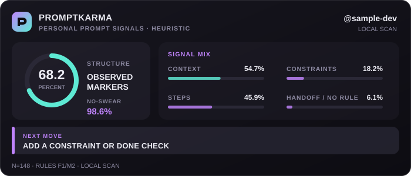

<div align="center">

# promptkarma

**Claude Code 로그를 내 컴퓨터에서만 읽고, 프롬프트 습관과 다음에 바꿔볼 한 가지를 알려주는 작은 코치입니다.**



[**온라인 배지 스튜디오에서 내 카드 만들기 →**](https://promptkarma.vercel.app)

</div>

## 왜 쓰나요?

AI가 같은 내용을 되묻거나, 수정 요청이 빙빙 돌거나, 무엇을 끝으로 볼지 적기 어려웠던 세션 뒤에 실행해보세요. promptkarma가 그 원인을 증명하지는 않습니다. 대신 내가 자주 쓰거나 빠뜨린 표현을 다음처럼 나눠 보여줍니다.

- 파일·코드·링크처럼 **작업 맥락**을 주는가
- 조건·요구사항·완료 기준을 **분명히 적는가**
- 큰 요청을 **단계나 목록**으로 나누는가
- “알아서 해”, “아무거나 골라”처럼 기준 없이 결정을 **통째로 넘기는가**

낮게 관찰된 항목은 능력이나 부족함을 판정하는 점수가 아닙니다. 다음 프롬프트에서 한 번 시험해볼 후보 하나를 제안하는 데만 씁니다. 욕설 어근 일치는 필요할 때만 보는 별도의 말투 참고값입니다. 원문은 서버로 보내지 않습니다.

> promptkarma는 능력 검사나 자격증이 아닙니다. 정규식으로 관찰한 작성 신호를 설명하는 휴리스틱입니다.

## 3단계로 씁니다

### 1. 로컬에서 스캔

Node.js 22가 설치된 컴퓨터에서 바로 실행할 수 있습니다. 첫 실행에서는 npm이 패키지를 내려받습니다.

현재는 Claude Code의 `~/.claude/projects/` 세션만 읽습니다.

```bash
npx --yes promptkarma scan
```

### 2. 결과 확인

터미널에서 네 가지 작성 신호와 다음에 시험할 한 가지를 확인합니다. 어떤 문장이 규칙에 잡혔는지 보고 싶다면 설명 모드를 씁니다.

```bash
npx --yes promptkarma scan --explain
```

### 3. 원할 때만 공유

```bash
npx --yes promptkarma submit <github-username>
```

[배지 스튜디오](https://promptkarma.vercel.app)에서 사용자명, 카드, 테마를 고르고 README 코드를 복사합니다. 로그인은 필요 없습니다. 공개 스캔 전에는 `COLLECTING` 카드가 보이며, 같은 주소를 먼저 README에 붙여도 나중에 `submit`한 값으로 갱신됩니다.

## 스캔 결과

```text
promptkarma · 로컬 스캔
──────────────────────────────────
사람 프롬프트    128개

프롬프트 습관
  구조 신호      43.8%
  맥락 단서      31.3%  파일·코드·링크
  조건·기준      18.8%
  단계·목록      12.5%
  통째 위임       3.1%  알아서 해·아무거나 골라 등

말투 참고 (선택)
  욕설 어근 일치   1.6%

다음에 해볼 한 가지
  큰 요청은 두 단계 이상의 목록으로 나눠 적어보세요.
```

표본이 30개보다 적으면 요약을 만들지 않고 얼마나 더 필요한지만 알려줍니다.

## 어떻게 측정하나요?

사람이 직접 입력한 Claude Code 프롬프트만 골라 다음 신호를 셉니다.

| 관찰값 | 규칙 |
|---|---|
| 맥락 단서 | 파일 경로, 코드 블록, URL 중 하나 이상 |
| 조건·기준 | `조건`, `요구사항`, `반드시`, `must` 같은 표현 |
| 단계·목록 | 목록 항목이 두 개 이상 |
| 통째 위임 | `알아서 해`, `아무거나 골라`, `대충 고쳐`, `you decide`처럼 기준 없이 결정을 넘기는 표현 |
| 구조 신호 | 맥락·조건·단계 중 하나 이상 |
| 말투 참고 | 공개된 한글·영문 욕설 어근에 하나 이상 일치 |

도구 출력, 에이전트가 넣은 메시지, 5,000자를 넘는 붙여넣기, 중복 UUID는 제외합니다. 규칙은 단순하고 재현 가능하지만 문맥을 완전히 이해하지 못하므로 오탐과 누락이 생길 수 있습니다.

`npx --yes promptkarma scan --explain`을 쓰면 각 신호가 잡힌 짧은 예시를 터미널에서 확인할 수 있습니다. 예시는 화면에만 표시하며 `state.json`에 저장하거나 서버로 보내지 않습니다.

## 로컬 카드

스캔 뒤 로컬 SVG를 만들 수 있습니다.

```bash
npx --yes promptkarma card <label>
```

생성 위치는 `~/.promptkarma/card.svg`입니다. 기본 카드는 다음 정보를 숨기지 않습니다.

- 실제 구조 신호 비율
- 선택형 말투 참고값
- 표본 수
- 휴리스틱 규칙 버전
- 로컬 스캔인지 자기신고 공개값인지
- 다음에 해볼 한 가지

## 공개 배지

```markdown
[](https://promptkarma.vercel.app)
```

현재 서버는 GitHub 계정 소유권과 로컬 로그의 진위를 확인하지 못합니다. 그래서 공개 카드는 `SELF-REPORTED`로 표시합니다. URL에 지표를 직접 넣은 카드는 `UNVERIFIED URL DATA`로 표시합니다.

계정 연결을 나중에 추가하더라도 확인되는 것은 “이 GitHub 계정이 제출했다”는 사실뿐입니다. 원본 로그를 믿을 수 있는 환경에서 검사하지 않는 한 능력이나 지표가 검증됐다고 표현하지 않습니다.

### 카드와 테마

| 값 | 모습 |
|---|---|
| `style=coach` | 기본 카드. 네 가지 신호와 다음 행동 |
| `style=polytope` | 구조 신호로 모양이 바뀌는 움직이는 시각 실험 |
| `style=classic` | 기존 500×200 가로 카드 |
| `theme=black` | 기본 어두운 테마 |
| `theme=cyberpunk` | 분홍·하늘색 네온 테마 |
| `theme=ivory` | 밝은 아이보리 테마 |
| `theme=korean` | 한지색 테마 |

스타일을 생략하면 `coach`가 사용됩니다. 예전에 쓰던 `style=feedback` 주소도 계속 같은 코치 카드를 보여줍니다. 다포체는 현재 전용 어두운 테마를 씁니다.

```markdown

```

## 개인정보

- 원문 프롬프트는 메모리에서 집계한 뒤 버립니다.
- `~/.promptkarma/state.json`에는 숫자와 측정 시각만 저장합니다.
- `submit`을 실행할 때만 집계 숫자를 서버로 보냅니다.
- 공개 공유가 필요 없으면 `scan`과 로컬 카드만 사용하면 됩니다.

## 알려진 한계

- Claude Code만 지원합니다.
- 평생 누적값이라 최근 변화나 7일·30일 추세를 아직 보여주지 않습니다.
- 구조 표현이 실제 작업 성공률을 높이는지는 아직 검증하지 않았습니다.
- 공개 제출에 인증이 없어 다른 사용자의 값을 막지 못합니다.

첫 화면과 공유 경험 개선은 [이슈 #6](https://github.com/Youkamii/promptkarma/issues/6)에 정리했습니다.

## 개발

```bash
bun run typecheck
bun run test
bun run build
```

핵심 지표·피드백 회귀 검사와 기존 다포체 회귀 검사를 함께 실행합니다.

## License

MIT
